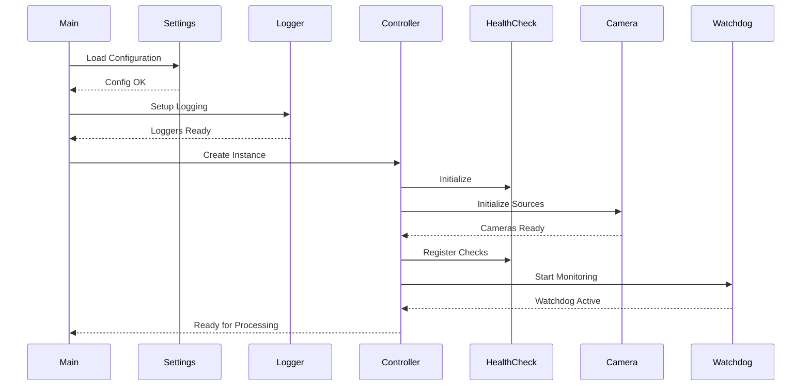
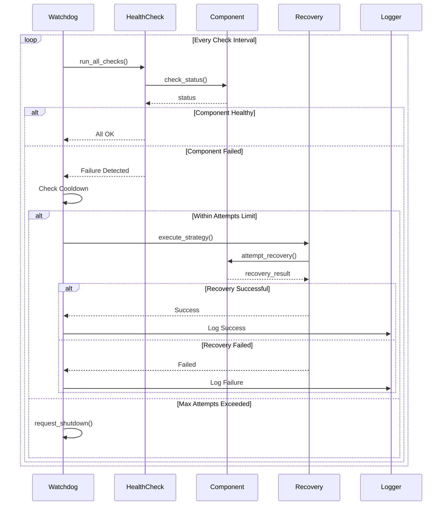
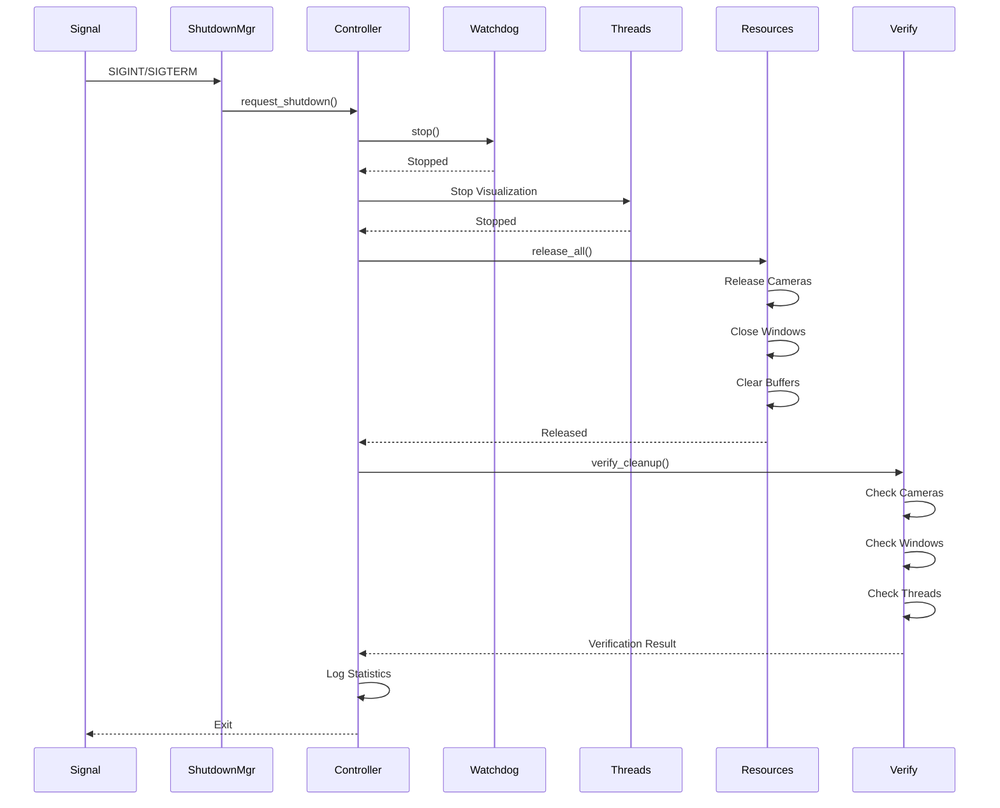

# Arquitetura do Sistema - Smart Traffic Light

## 📋 Visão Geral

Este documento descreve a arquitetura completa do sistema Smart Traffic Light, incluindo decisões de design, padrões utilizados, fluxos de dados e justificativas técnicas.

**Versão:** 2.0.0  
**Arquitetura:** Modular, orientada a eventos, production-ready  
**Última Atualização:** 2025-11-07

---

## 🎯 Princípios Arquiteturais

### 1. Separação de Responsabilidades
Cada módulo tem uma responsabilidade clara e bem definida, facilitando manutenção e testes.

### 2. Type Safety
Uso extensivo de type hints e abstrações type-safe para prevenir erros em tempo de execução.

### 3. Resource Management
Gerenciamento explícito de todos os recursos (câmeras, arquivos, memória) com cleanup garantido.

### 4. Observabilidade
Logging estruturado e monitoramento de saúde em todos os níveis do sistema.

### 5. Resiliência
Auto-recovery, graceful degradation e shutdown seguro em todas as situações.

---

## 🏛️ Visão Geral da Arquitetura

```
┌─────────────────────────────────────────────────────────────────┐
│                     SMART TRAFFIC LIGHT SYSTEM                   │
│                         (Raspberry Pi 4)                          │
└─────────────────────────────────────────────────────────────────┘
                                 │
                    ┌────────────┴────────────┐
                    │                         │
          ┌─────────▼────────┐      ┌────────▼─────────┐
          │   Camera A       │      │   Camera B       │
          │  (USB/Pi Cam)    │      │  (USB/Pi Cam)    │
          └─────────┬────────┘      └────────┬─────────┘
                    │                         │
                    └────────────┬────────────┘
                                 │
                    ┌────────────▼────────────┐
                    │   Application Layer     │
                    │  (TrafficController)    │
                    └────────────┬────────────┘
                                 │
                    ┌────────────┴────────────┐
                    │                         │
         ┌──────────▼─────────┐    ┌─────────▼──────────┐
         │  Detection Layer   │    │  Communication     │
         │  (AI/ML Models)    │    │  (Orchestrator)    │
         └──────────┬─────────┘    └─────────┬──────────┘
                    │                         │
         ┌──────────▼─────────┐    ┌─────────▼──────────┐
         │  Infrastructure    │    │   Monitoring       │
         │  (Resources/Logs)  │    │  (Health/Watch)    │
         └────────────────────┘    └────────────────────┘
```

---

## 📦 Estrutura de Módulos

### Camada de Utilidades (src/utils/)

#### 1. logger.py - Sistema de Logging Estruturado

**Responsabilidade:** Logging centralizado, thread-safe e estruturado.

**Componentes:**
- `setup_logger()` - Configuração de loggers
- `get_logger()` - Obtenção de logger por módulo
- `LogContext` - Context manager para timing
- `@log_execution_time` - Decorator para métricas

**Características:**
- Logs coloridos para console
- Rotação automática (10MB, 5 backups)
- Três arquivos especializados (geral, erro, performance)
- Thread-safe com locks
- Formatação consistente

**Exemplo de Uso:**
```python
from src.utils.logger import get_logger, log_execution_time

logger = get_logger(__name__)

@log_execution_time
def process_frame(frame):
    logger.info("Processing frame")
    # processamento
    logger.debug(f"Frame shape: {frame.shape}")
```

#### 2. resource_manager.py - Gerenciamento de Recursos

**Responsabilidade:** Rastreamento e gerenciamento de recursos do sistema.

**Componentes:**

##### A. TempFileManager
```python
with TempFileManager() as tmp:
    temp_file = tmp.create_temp_file('.jpg')
    # uso do arquivo
    # cleanup automático
```

**Features:**
- Context manager para segurança
- Rastreamento de arquivos criados
- Cleanup automático mesmo com exceções
- Limpeza de arquivos órfãos

##### B. ResourceTracker
```python
tracker = get_global_tracker()
tracker.track_camera(camera)
tracker.track_window("Window Name")
# ... uso ...
tracker.release_all()
```

**Features:**
- Rastreamento de VideoCapture
- Rastreamento de janelas OpenCV
- Estatísticas de uso
- Detecção de vazamentos

##### C. FrameBuffer
```python
buffer = FrameBuffer(
    max_frames=100,
    output_dir='frames',
    max_memory_mb=50
)
buffer.save_current(frame, 'A', cycle)
```

**Features:**
- Rotação automática de frames
- Limite de memória configurável
- Compressão JPEG
- Verificação de espaço em disco

#### 3. healthcheck.py - Sistema de Health Checks

**Responsabilidade:** Monitoramento de saúde de componentes do sistema.

**Componentes:**
- `HealthCheck` - Gerenciador de health checks
- `HealthCheckResult` - Resultado de uma verificação
- `BuiltInHealthChecks` - Checks pré-definidos

**Checks Disponíveis:**
- Memória do sistema
- Espaço em disco
- Status de câmeras
- Modelos carregados
- Tempo de processamento
- Threads ativas

**Fluxo:**
```
Register Check → Run Check → Analyze Result → Track Failures → Report Status
```

#### 4. watchdog.py - Auto-Recovery System

**Responsabilidade:** Monitoramento contínuo e recuperação automática.

**Componentes:**
- `Watchdog` - Monitor principal
- `RecoveryStrategy` - Estratégia de recuperação
- `RecoveryAction` - Ações possíveis

**Ações de Recuperação:**
```python
RecoveryAction.FORCE_GC          # Garbage collection
RecoveryAction.CLEAN_TEMP_FILES  # Limpar arquivos
RecoveryAction.REINIT_CAMERA     # Reiniciar câmera
RecoveryAction.RELOAD_MODEL      # Recarregar modelo
RecoveryAction.REQUEST_SHUTDOWN  # Shutdown gracioso
```

**Fluxo de Recuperação:**
```
Health Check Fail → Check Cooldown → Execute Strategy → 
Verify Recovery → Update Stats → Log Result
```

---

### Camada de Configuração (src/settings/)

#### settings.py - Sistema Unificado

**Responsabilidade:** Gerenciamento centralizado de todas as configurações.

**Arquitetura:**
```python
@dataclass
class Settings:
    system: SystemSettings
    camera: CameraSettings
    detection: DetectionSettings
    performance: PerformanceSettings
    logging: LoggingSettings
    traffic_control: TrafficControlSettings
    network: NetworkSettings
```

**Características:**
- Type-safe com dataclasses
- Validação automática
- Carregamento de .env
- Singleton pattern
- Detecção de plataforma

**Hierarquia de Configuração:**
```
Valores Padrão → .env → Variáveis de Ambiente → Overrides em Código
```

---

### Camada de Aplicação (src/application/)

#### 1. camera_source.py - Abstrações Type-Safe

**Responsabilidade:** Interface unificada para diferentes fontes de câmera.

**Arquitetura:**
```
┌─────────────────────┐
│   CameraSource      │ ← Interface Abstrata
│   (ABC)             │
└──────────┬──────────┘
           │
     ┌─────┴─────┬─────────────┬────────────┐
     │           │             │            │
┌────▼────┐ ┌───▼────┐  ┌─────▼──────┐ ┌──▼───────┐
│ Live    │ │ Static │  │ Video      │ │ Factory  │
│ Camera  │ │ Image  │  │ File       │ │          │
└─────────┘ └────────┘  └────────────┘ └──────────┘
```

**Implementações:**

##### LiveCameraSource
```python
with LiveCameraSource(0) as camera:
    success, frame = camera.read()
    props = camera.get_properties()
```

**Features:**
- Integração com cv2.VideoCapture
- Configuração automática
- Resource tracking
- Type-safe

##### StaticImageSource
```python
camera = StaticImageSource('test.jpg')
success, frame = camera.read()  # Sempre retorna mesma imagem
```

**Features:**
- Para testes e desenvolvimento
- Memory efficient
- Comportamento consistente

##### VideoFileSource
```python
camera = VideoFileSource('video.mp4', loop=True)
success, frame = camera.read()  # Loop automático
```

**Features:**
- Looping configurável
- Resource tracking
- Mesma interface que câmera

##### CameraFactory
```python
# Criação inteligente baseada em parâmetros
camera = CameraFactory.create(camera_index=0)
camera = CameraFactory.create(test_image_path='test.jpg')
camera = CameraFactory.create_from_settings('camera_a')
```

**Benefícios:**
- Eliminação de type mixing
- Código mais testável
- Fácil adicionar novos tipos
- Comportamento previsível

#### 2. traffic_controller.py - Orquestração Principal

**Responsabilidade:** Orquestração de todo o sistema.

**Componentes:**
- `TrafficLightController` - Controller principal
- `ShutdownManager` - Gerenciamento de shutdown
- Signal handlers (SIGINT, SIGTERM)

**Ciclo de Vida:**
```
Init → Setup Health → Init Cameras → Start Watchdog → 
Processing Loop → Signal/Error → Cleanup → Verify → Exit
```

---

### Camada de Modelos (src/models/)

#### car_identify.py - Detecção Thread-Safe

**Responsabilidade:** Detecção de veículos com suporte a múltiplos modelos.

**Arquitetura:**
```python
class CarIdentifier:
    def __init__(self):
        self._lock = threading.RLock()  # Thread safety
        self.background_subtractor = ...  # Por instância
        self.tflite_model = ...
        self.custom_model = ...
```

**Features:**
- Thread-safe com RLock
- Suporte a múltiplos modelos (TFLite, SVM, CV)
- Background subtractor isolado por instância
- Métricas de performance

**Fluxo de Detecção:**
```
Frame → Acquire Lock → Preprocess → Model Inference → 
Post-process → Release Lock → Return Count
```

---

### Camada de Treinamento (src/training/)

#### data_validator.py - Validação de Dados

**Responsabilidade:** Validação de qualidade de dados de treinamento.

**Componentes:**
- `TrainingDataValidator` - Validador principal
- `ValidationResult` - Resultado da validação
- `ImageQualityReport` - Relatório de qualidade

**Verificações:**
```
Samples Count → Image Quality → Class Balance → 
Duplicates → Format Validation → Generate Report
```

**Thresholds:**
- **Quick:** min 10 samples, 32x32px, 20:1 imbalance
- **Standard:** min 100 samples, 64x64px, 10:1 imbalance
- **Strict:** min 200 samples, 128x128px, 5:1 imbalance

---

## 🔄 Fluxos de Dados

### 1. Fluxo de Inicialização



### 2. Fluxo de Processamento

```mermaid
sequenceDiagram
    participant Loop
    participant CameraA
    participant CameraB
    participant Detector
    participant Decision
    participant Orchestrator
    participant Health

    loop Every Cycle
        Loop->>CameraA: read()
        CameraA-->>Loop: frame_a
        
        Loop->>CameraB: read()
        CameraB-->>Loop: frame_b
        
        Loop->>Detector: count_cars(frame_a)
        Detector-->>Loop: count_a
        
        Loop->>Detector: count_cars(frame_b)
        Detector-->>Loop: count_b
        
        Loop->>Decision: make_decision(count_a, count_b)
        Decision-->>Loop: traffic_light
        
        Loop->>Orchestrator: send_decision(traffic_light)
        Loop->>Orchestrator: send_status(count_a, count_b)
        
        alt Every 10 Cycles
            Loop->>Health: Check Health Status
            Health-->>Loop: Status Report
        end
    end
```

### 3. Fluxo de Monitoramento e Recovery



### 4. Fluxo de Shutdown



---

## 🎨 Padrões de Design

### 1. Singleton Pattern

**Uso:** Settings, ResourceTracker

```python
_instance = None

def get_settings():
    global _instance
    if _instance is None:
        _instance = Settings()
    return _instance
```

**Justificativa:** Garantir única instância de configuração e tracker global.

### 2. Factory Pattern

**Uso:** CameraFactory

```python
class CameraFactory:
    @staticmethod
    def create(camera_index=None, test_image_path=None, ...):
        if test_image_path:
            return StaticImageSource(test_image_path)
        elif camera_index is not None:
            return LiveCameraSource(camera_index)
        # ...
```

**Justificativa:** Criação inteligente baseada em parâmetros, esconde complexidade.

### 3. Strategy Pattern

**Uso:** RecoveryStrategy

```python
@dataclass
class RecoveryStrategy:
    component: str
    max_attempts: int
    actions: list[RecoveryAction]
    cooldown_seconds: float
```

**Justificativa:** Diferentes estratégias de recuperação por componente.

### 4. Observer Pattern

**Uso:** Watchdog observa HealthCheck

```python
watchdog = Watchdog(health_check=health_check)
# Watchdog monitora e reage a mudanças de estado
```

**Justificativa:** Monitoramento reativo e desacoplado.

### 5. Context Manager Pattern

**Uso:** TempFileManager, CameraSource

```python
with TempFileManager() as tmp:
    file = tmp.create_temp_file()
    # uso
    # cleanup automático
```

**Justificativa:** Garantia de cleanup mesmo com exceções.

### 6. Facade Pattern

**Uso:** get_settings(), create_car_identifier()

```python
settings = get_settings()  # Esconde complexidade
identifier = create_car_identifier('rpi')
```

**Justificativa:** Interface simplificada para sistemas complexos.

---

## 🔐 Thread Safety

### Componentes Thread-Safe

#### 1. CarIdentifier
```python
class CarIdentifier:
    def __init__(self):
        self._lock = threading.RLock()
    
    def count_cars(self, frame):
        with self._lock:
            # processamento thread-safe
            return count
```

**Proteção:** Background subtractor e estado interno.

#### 2. Logger
```python
_logger_lock = threading.Lock()

def setup_logger(name):
    with _logger_lock:
        # criação thread-safe de logger
        pass
```

**Proteção:** Criação e cache de loggers.

#### 3. ShutdownManager
```python
class ShutdownManager:
    def __init__(self):
        self._lock = threading.Lock()
        self._shutdown_event = threading.Event()
```

**Proteção:** Coordenação de shutdown entre threads.

#### 4. ResourceTracker
```python
class ResourceTracker:
    def __init__(self):
        self._lock = threading.RLock()
```

**Proteção:** Rastreamento concorrente de recursos.

---

## 💾 Gerenciamento de Memória

### Estratégias

#### 1. Instâncias Separadas
```python
# Evitar compartilhamento entre threads
self.car_identifier_a = create_car_identifier()
self.car_identifier_b = create_car_identifier()
```

#### 2. Rotação de Frames
```python
buffer = FrameBuffer(max_frames=100)
# Mantém apenas últimos 100 frames
```

#### 3. Cleanup Explícito
```python
try:
    # uso de recurso
finally:
    resource.release()
```

#### 4. Garbage Collection Forçado
```python
def _action_force_gc(self):
    import gc
    gc.collect()
```

#### 5. Context Managers
```python
with managed_camera(0) as camera:
    # uso
    # release automático
```

---

## 📊 Decisões Técnicas

### 1. Python 3.9+

**Decisão:** Usar Python 3.9 ou superior

**Justificativa:**
- Type hints melhorados
- Performance improvements
- Suporte a dataclasses
- Compatibilidade com OpenCV e TensorFlow

### 2. Dataclasses para Configuração

**Decisão:** Usar dataclasses em vez de dicts

**Justificativa:**
- Type safety
- IDE autocomplete
- Validação automática
- Código mais limpo

### 3. Abstrações Type-Safe para Câmeras

**Decisão:** Criar CameraSource abstrata

**Justificativa:**
- Eliminar type mixing bugs
- Interface consistente
- Código mais testável
- Fácil adicionar novos tipos

### 4. Logging Estruturado

**Decisão:** Sistema de logging profissional

**Justificativa:**
- Debugging eficiente
- Análise de performance
- Compliance
- Troubleshooting facilitado

### 5. Health Checks + Watchdog

**Decisão:** Sistema de monitoramento ativo

**Justificativa:**
- Detecção precoce de problemas
- Auto-recovery
- Uptime melhorado
- Menos intervenção manual

### 6. Resource Tracking

**Decisão:** Rastreamento explícito de recursos

**Justificativa:**
- Zero vazamentos
- Debugging facilitado
- Estatísticas de uso
- Operação indefinida

---

## 🔮 Escalabilidade

### Limitações Atuais

1. **Processamento Single-Thread**
   - Detecção é thread-safe mas sequencial
   - Limita FPS máximo processado

2. **Local Storage**
   - Frames salvos localmente
   - Limite de disco

3. **Single Instance**
   - Uma instância por sistema
   - Sem load balancing

### Melhorias Futuras

#### 1. Processamento Paralelo
```python
# Pool de workers para detecção
with ThreadPoolExecutor(max_workers=4) as executor:
    futures = [
        executor.submit(detect, frame)
        for frame in frames
    ]
```

#### 2. Cloud Storage
```python
# Upload assíncrono para cloud
async def upload_frame(frame):
    await s3_client.put_object(...)
```

#### 3. Múltiplas Instâncias
```python
# Load balancer
@dataclass
class TrafficLightCluster:
    instances: List[TrafficLightController]
    load_balancer: LoadBalancer
```

#### 4. Metrics Export
```python
# Prometheus metrics
from prometheus_client import Counter, Gauge

frames_processed = Counter('frames_processed_total')
detection_time = Gauge('detection_time_seconds')
```

---

## 📚 Referências e Recursos

### Documentação Relacionada
- [RESUMO_CORRECOES.md](../RESUMO_CORRECOES.md) - Histórico de melhorias
- [GUIA_PRODUCAO.md](GUIA_PRODUCAO.md) - Deployment em produção
- [RESOURCE_MANAGEMENT.md](RESOURCE_MANAGEMENT.md) - Gerenciamento de recursos
- [HEALTH_MONITORING.md](HEALTH_MONITORING.md) - Sistema de monitoramento
- [DATA_VALIDATION.md](DATA_VALIDATION.md) - Validação de dados

### Padrões e Práticas
- Clean Code (Robert C. Martin)
- Design Patterns (Gang of Four)
- Python Type Hints (PEP 484)
- SOLID Principles

### Frameworks e Bibliotecas
- OpenCV - Computer vision
- TensorFlow Lite - ML inference
- Python threading - Concurrency
- Python dataclasses - Configuration

---

**Versão da Arquitetura:** 2.0.0  
**Status:** ✅ Production Ready  
**Última Revisão:** 2025-11-07